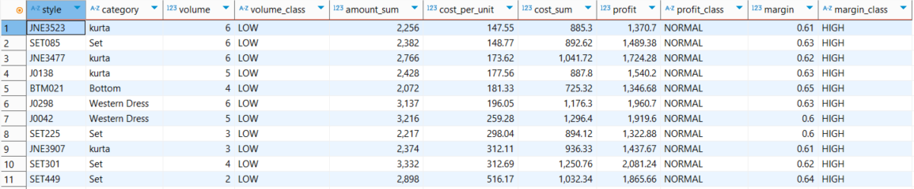

# E-Commerce Product Profitability Analysis (Amazon Dataset)

## Objective:
Identify which **product categories generate high sales but low profits**, and suggest ways to improve profitability.

The dataset included over 1,000 unique products across more than 100,000 transaction records, each capturing details like cost, price, quantity sold, and fulfillment method.

---

## Summary of Insights

### Category Performance:
- Most low-margin, high-volume products are concentrated in **kurta**, **set**, and **top** categories.
- These categories may suffer from overly aggressive pricing or high fulfillment costs.

### Margin Distribution:
- Majority of products have margin between 0.3–0.6.
- Few products fall below 0.3 margin — potential pricing inefficiencies.

### Volume & Profit Skew:
- Most products sell fewer than 25 units.
- Very few products generate high profit — profitability is driven by a small subset of products.

### High Volume but Low Margin Categories

---

## Additional Findings

-  **Kurta** and **Set** appear in both top-selling and low-margin categories – high sales but weak margins.
-  Out of ~2,000 underperforming orders, over **1,400 were linked to promotions**, mostly Free Shipping.
-  **Amazon-fulfilled products** showed higher sales volume, while **Merchant-fulfilled** ones had more margin variation.
-  **No major margin differences** across sizes, although XS and 3XL had fewer sales.

---

## Recommendations

- **Review fulfillment and pricing** strategy for categories like **kurta** and **set**, especially where promotions or Amazon fulfillment are frequent.
- **Promote or bundle** products with high margins but low volume to improve profitability without affecting unit economics.
- **Investigate backend costs** (e.g., fulfillment fees) for low-margin products with stable pricing across variants.

### High Margin, Low Volume Table

---

## Visuals

These histograms highlight the distribution of key metrics:

| Metric | Insight |
|--------|---------|
| **Volume** | Most products have very low sales volume. Only a few products qualify as high-volume "movers." |
| **Profit** | Profit is heavily skewed – most products generate low profits, and only a few bring in substantial earnings. |
| **Margin** | Margins are more evenly distributed, but relatively few products have a margin below 0.3. |

---

## Tech Stack

- **SQL (PostgreSQL)** – data cleaning, aggregation, classification
- **Python (Pandas, Plotly)** – analysis and visualization
- **Jupyter Notebook** – interactive EDA and logic tracking
